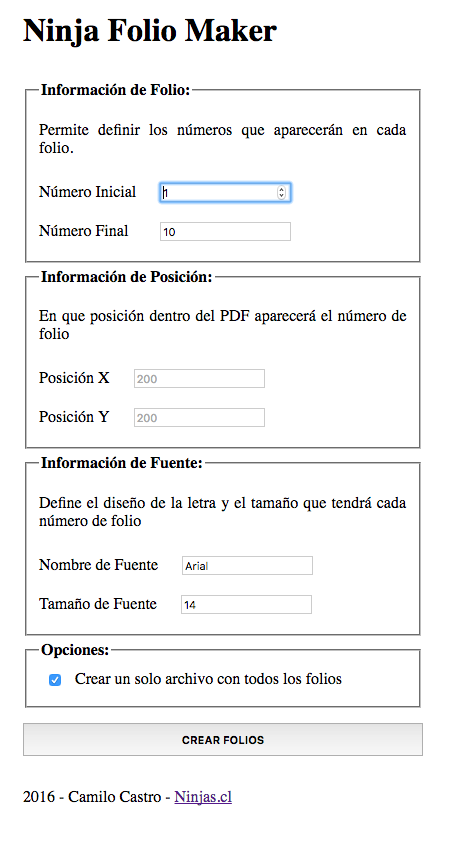

# Ninja Folio Maker
Permite Generar Números de Folio en Archivos PDF. Útil para cuando se necesita generar un documento con una serie de copias numeradas consecutivamente.

## Requisitos
- PHP 5.4 o superior
- Navegador con soporte para HTML5

## Modo de Uso

### Primer Paso
Usar un servidor web o el servidor interno de php

```
$ cd ~/public_html
$ php -S localhost:8000
```
Luego abrir navegador web en la dirección escogida. (en este caso localhost:8000)

### Segundo Paso
Reemplazar el archivo `folio_template.pdf` por la plantilla PDF que se desea usar para generar los folios. El sistema solamente ubicará el número de folio en la primera página de la plantilla.

### Tercer Paso
Conocer los valores horizontal (Posición X) y vertical (Posición Y) donde se debe escribir el número de folio. Se recomienda realizar algunas pruebas con un solo folio para conocer el valor adecuado.


## Screenshot



## Licencia
[MIT](LICENSE)

## Copyright
2016, Hecho con &#9829; por [Ninjas.cl](http://ninjas.cl)
